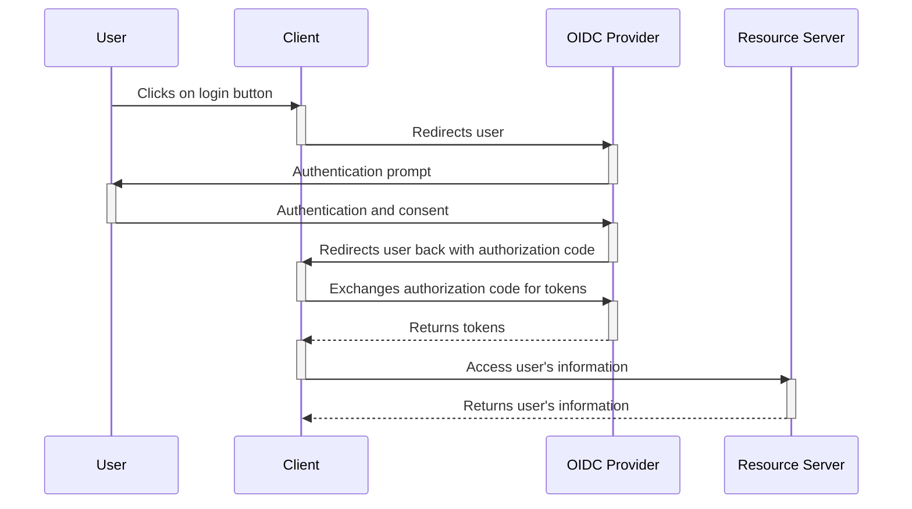

# Going Authy

OIDC authentication provider built on Golang inspired in Going Merry from One Piece.

## About OIDC

OpenID Connect (OIDC) is an authentication layer on top of OAuth 2.0, an authorization framework. The standard is controlled by the OpenID Foundation.

### OIDC Flow

A typical OIDC flow involves the following steps:

1. The user clicks on a login button on the client application.
2. The client application redirects the user to the OIDC provider.
3. The OIDC provider prompts the user for authentication and consent.
4. The user authenticates and consents.
5. The OIDC provider redirects the user back to the client application with an authorization code.
6. The client application exchanges the authorization code for tokens.
7. The OIDC provider returns the tokens to the client application.
8. The client application can now use the tokens to access the user's information.

## About Going Merry

Going Merry is a fictional ship from the anime and manga series One Piece. It is the first ship of the Straw Hat Pirates that they use as their main mode of transportation through the East Blue and Grand Line.

## Motivation

I just wanted to learn more about OIDC and Golang. If you want to make use of this project, please read the license.
